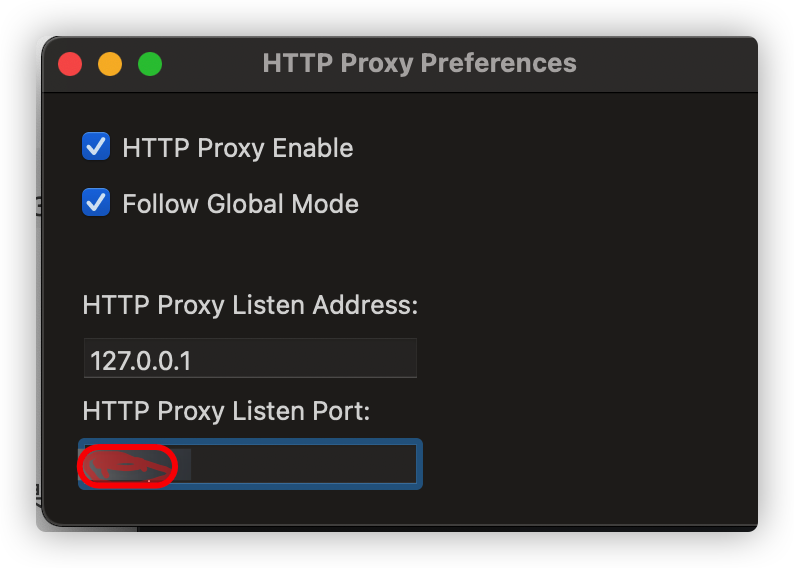
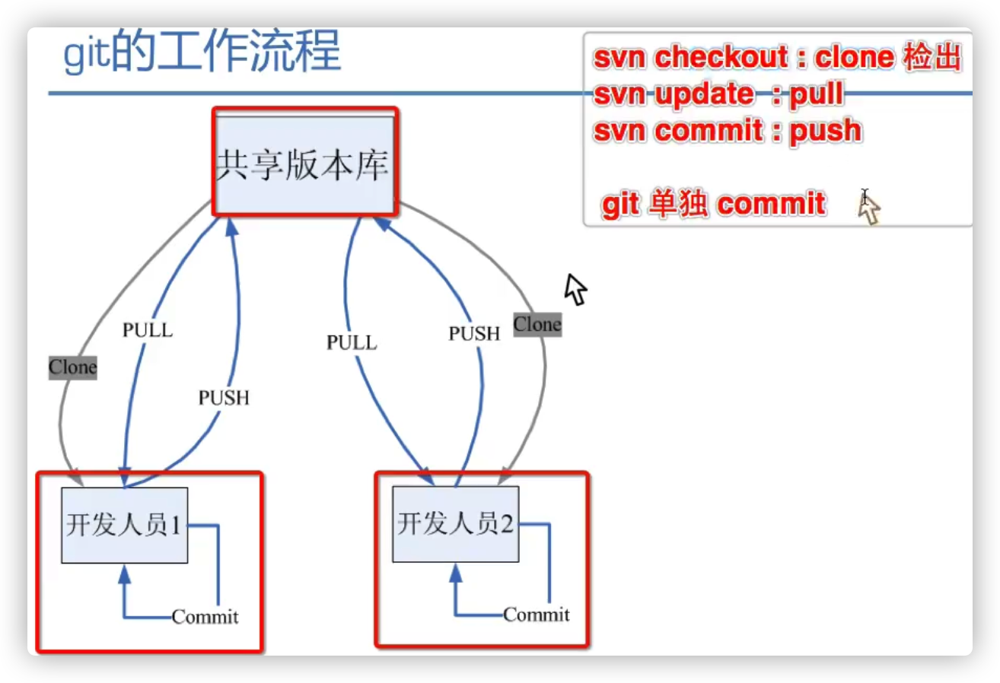
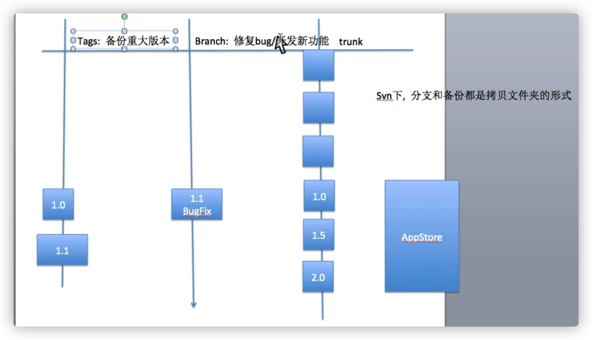
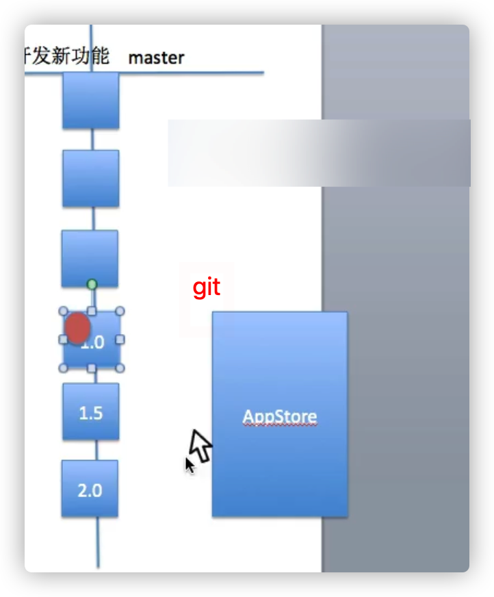

# 建库

1、github网页上复制新建库的地址

2、git:输入git clone 粘贴地址

# 加入文件

**Mac:cd 文件路径**

1、git:输入git status:查看状态

2、**git add .** :添加

3、git status

4、git commit -m "自己添加备注"

5、git push:上传云端 git push -u origin main

更改文件内容也同理

# 删除库

github里的 settings

Danger Zone

delete this repository

# 远程更新

先从远程仓库下载一个 temp

**git remote -v**

从 main remote repo 下载到 temp 分支

**git fetch origin main:temp**

对比 temp & local

**git diff temp**

没问题之后 合并操作

**git merge temp**

删除之前下载的 temp 分支 => 大功告成

**git branch -d temp**

# 修复错误提交身份

```apl
# 修复 commit 的时候 因为 local git config 而造成的错误身份提交
# see below docs
# https://juejin.cn/post/6844903987448283144
# https://blog.csdn.net/yusufolu9/article/details/53706269
# 关键命令 
cd .git
git config user.name "以后用于该仓库提交的身份的 user name"
git config user.email "以后用于该仓库提交的身份 email"

# 查看文件是否修改成功 主要看 username useremail
cat config 

# 返回上一级目录 根目录
cd ../
# 创建脚本文件 代码如下 
touch email.sh
# 打开文件 加入以下代码
#!/bin/sh

git filter-branch --env-filter '

OLD_EMAIL="之前错误提交的那个身份的邮箱"
CORRECT_NAME="新的正确的身份的名字"
CORRECT_EMAIL="新的正确的邮箱"

# 执行修复的代码
if [ "$GIT_COMMITTER_EMAIL" = "$OLD_EMAIL" ]
then
    export GIT_COMMITTER_NAME="$CORRECT_NAME"
    export GIT_COMMITTER_EMAIL="$CORRECT_EMAIL"
fi
if [ "$GIT_AUTHOR_EMAIL" = "$OLD_EMAIL" ]
then
    export GIT_AUTHOR_NAME="$CORRECT_NAME"
    export GIT_AUTHOR_EMAIL="$CORRECT_EMAIL"
fi
' --tag-name-filter cat -- --branches --tags

# 本质上小绿点是根据邮箱为关键字段去确认的

# mac 上修改文件的权限 如果发生 permission denied 的情况
chmod 777 email.sh

# 执行脚本
./email.sh
# 会出现重写前的倒计时警告, 给 ctrl C 去取消, 过一会就会陆续重写所有记录

# 重写所有记录之后 重新 push 到 remote repo]
git push origin --force --all
# 或者修改一下文件 然后重新 git add . commit push ...

# 如果 第二次想要继续执行 email.sh 的文件报错的时候 说 本地已经有一个 backup 需要-f 啥的删除 才能去强制重写
# 此时我们需要 通过下面的命令 删除本地的一个备份
git filter-branch -f \
--index-filter 'git rm --cached --ignore-unmatch Rakefile' HEAD
# 执行完之后重新执行 重写 log 里面提交邮箱的脚本文件 ./email.sh

# 如果上面的方法都失败了
# 实在不行的话 就把整个本地的 repo 删掉, 重新下载, 然后进去 .git 重新配置该 repo 下的 username email
# 重新执行上面的步骤
```

# git翻墙

```
git config --global http.proxy http://localhost:8123
git config --global https.proxy http://localhost:8123
```

可以用`git config --list`查看是否设置成功。



把8123替换成红色区域（shadowsocks)的数字

# ================

# git

- git：源代码管理工具
- Github,xcode： 图形界面客户端

# xcode使用github

https://www.jianshu.com/p/99a77e278bce

https://www.jianshu.com/p/151381ae9073

https://blog.csdn.net/qq_43768946/article/details/90411154

**在提交git之前查看配置 .gitignore**

要写一个`.gitignore`文件，首先我们得了解`.gitignore`文件的语法规范，然后知道那些文件是要被我们忽略的，最后注意`.gitignore`文件只会管理还未提交到git的文件

# git和SVN的简单对比

速度 在很多情况下，git的速度远远比SVN快

结构 SVN是集中式管理，git是分布式管理

SVN是集中式管理(代码的版本库, 只在一台服务器存在)

git是分布式管理(代码的版本库, 服务器和每一台客户端都存在)

其他 SVN使用分支比较笨拙(整体拷贝)，git可以轻松拥有无限个分支（标注） SVN必须联网才能正常工作，git支持本地版本控制工作 旧版本的SVN会在每一个目录置放一个.svn，git只会在根目录拥有一个.git





## SVN(拷贝)使用

在trunk里面开发，开发到一定阶段打tag（版本）并发布appStore

备份每个版本

如果发现之前的tag有bug，把改版本的项目放到分支里面，修改结束merge，干掉分支



# git常用指令

git help ：git指令帮助手册 查看其他指令的做法：git help 其他指令 搜索关键字:/ clone(翻页:F写一页,B上一页)
如果想退出帮助文档:输入Q

git config ：git的配置信息相关（修改的是.git/config文件） 配置用户名：git config “user.name” 用户名（用于跟踪修改记录） 配置邮箱：git config “user.email”
邮箱（用于多人开发间的沟通） 查看配置信息：git config –l 编辑配置信息：git config –e（用vim编辑，:wq是退出vim编辑器） 设置指令的别名：git config alias.别名 原指令名称
设置带参数指令的别名：git config alias.别名 “原指令名称 参数” 将此设置应用到整个系统中：git config ––gloabal

git status ：查文件的状态 查看某个文件的状态：git status 文件名 查看当前路径所有文件的状态：git status

git log ：查看文件的修改日志 查看某个文件的修改日志：git log 文件名 查看当前路径所有文件的修改日志：git log 用一行的方式查看简单的日志信息：git log ––pretty=oneline
查看最近的N次修改：git log –N（N是一个整数）

git diff ：查看文件最新改动的地方 查看某个文件的最新改动的地方：git diff 文件名 查看当前路径所有文件最新改动的地方：git diff

git init ：初始化一个空的本地仓库，生成一个.git目录，用于维护版本信息 在当前路径初始化仓库：git init 在其他路径初始化仓库：git init 仓库路径

git add ：将工作区的文件保存到暂缓区 保存某个文件到暂缓区：git add 文件名 保存当前路径的所有文件到暂缓区：git add .（注意，最后是一个点 . ）

git commit ：将暂缓区的文件提交到当前分支 提交某个文件到分支：git commit -m ”注释” 文件名 保存当前路径的所有文件到分支：git commit -m ”注释”

git reset ：版本回退（建议加上––hard参数，git支持无限次后悔） 回退到上一个版本：git reset ––hard HEAD^ 回退到上上一个版本：git reset ––hard HEAD^^ 回退到上N个版本：git
reset ––hard HEAD~N（N是一个整数） 回退到任意一个版本：git reset ––hard 版本号（版本号用7位即可）

git reflog ：查看指令使用记录（能够查看所有的版本号）

git rm：删除文件（删完之后要进行commit操作，才能同步到版本库）

git clone：下载远程仓库到本地 下载远程仓库到当前路径：git clone 仓库的URL 下载远程仓库到特定路径：git clone 仓库的URL 存放仓库的路径

git pull：下载远程仓库的最新信息到本地仓库

git push：将本地的仓库信息推送到远程仓库

# GitHub项目文件创建注意

添加.ignore文件

```
二. 设置忽略文件
1. 先去Github, 搜索.gitignore, 然后找到OC的忽略文件
2. 拷贝所有内容, 来到终端
3. echo -e "(com + V 输入粘贴内容)" > .gitignore
4. 保证.gitignore 跟.git在同一目录下 (.git这个目录才是git管理的目论)
5. 将.gitignore推送给远程服务器 add / commit  / push (一定要在创建项目之前)
6. 推送本地分支代码给服务器: git push
```

如何删除GIT中的.DS_Store

https://www.jianshu.com/p/fdaa8be7f6c3

# 删除之前未提交的commit 但是不回退未提交版本

Git log 红色复制

https://blog.csdn.net/qq_46106285/article/details/124744328

git reset --soft <无法上传的那次的上一个的id>

注：id输入6位以上就差不多可以了，多输入几位也行，不用全选

注：git reset 有三种模式：–soft、–hard和不加参数。

–soft是保留工作区的内容和add提交，只是切换指针
–hard是什么都不保留
不加参数是保留工作区的内容但是不保留add提交
在其他情况下，你也可以选择使用其他的参数。


# 删除历史版本，保留当前状态

https://blog.csdn.net/caicai0001000/article/details/122108495

1、创建并切换到lastest_branch分支

git checkout --orphan latest_branch

2、添加所有文件

git add -A

3、提交更改

git commit -am "删除历史版本记录，初始化仓库"

4、删除分支

git branch -D master

5、将当前分支重命名

git branch -m master

6、强制更新存储库

git push -f origin master

# LFS收费 坑！
