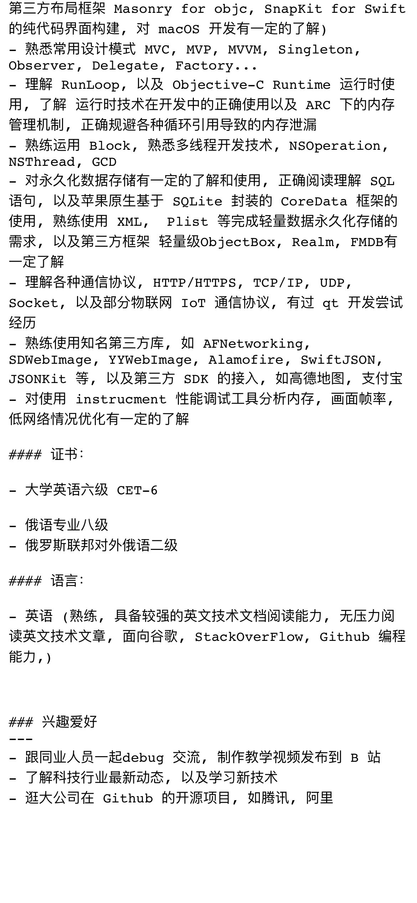
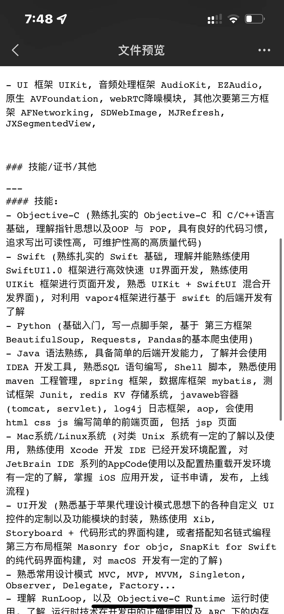

# 第三方库总结

## 等级

🥦 -> 一般 👍 -> 真棒 🚀 -> 必用

## 总结

https://github.com/Tim9Liu9/TimLiu-iOS -> 中文
https://github.com/cjwirth/awesome-ios-ui -> UI 开源库
https://ios.libhunt.com/ -> iOS 开源库排行

## 整体方案解决

https://github.com/BendingSpoons/tempura-swift

## UI

- 💜ImageView 加载 Swift & OC
- Kingfisher -> https://github.com/onevcat/Kingfisher
- SDWebImage -> https://github.com/SDWebImage/SDWebImage

- 💜轮播图 指引图
- FSPageView -> https://github.com/WenchaoD/FSPagerView -> 🥦

- 💜屏幕适配
- SwiftyFitsize -> https://github.com/LinXunFeng/SwiftyFitsize -> Swift -> 详细参考适配控制单例 -> 👍

- 💜布局 Layout
- SnapKit -> https://github.com/SnapKit/SnapKit -> Swift -> 🚀
- Masonry -> https://github.com/SnapKit/Masonry -> 🚀
- MyLinearLayout -> https://github.com/youngsoft/MyLinearLayout -> objc -> 🚀 太强大了 Demo 一定要看 👍
- TangramKit -> https://github.com/youngsoft/TangramKit -> swift -> 🚀👍 -> 就是 MyLinearLayout 的 swift 版本

- 💜UICollectionView Paging Layout 给到直接的 collection view cell 一个转换 transform 太厉害了
- CollectionViewPagingLayout -> https://github.com/amirdew/CollectionViewPagingLayout -> swift -> 🚀👍
- <#框架名称#> -> <#框架开源地址#> -> <#语言#> -> <#评分#>

- 💜浮动窗口 Floating Panel -> Swift
- https://github.com/scenee/FloatingPanel -> Swift -> 实现了横屏侧栏 -> 👍
- HWPanModal -> https://github.com/HeathWang/HWPanModal -> objc + swift -> 👍🚀

- 💜转场动画 Transition Animation
- Gemini -> https://github.com/shoheiyokoyama/Gemini -> Swift -> 👍

- 💜Photo Picker Editor 图片 视频选择器
- HXPhotoPicker -> https://github.com/SilenceLove/HXPhotoPicker -> objc+swift -> 👍🚀

- 💜Button 按钮
- SwiftyButton -> https://github.com/TakeScoop/SwiftyButton -> swift -> 无人维护
- <#框架名称#> -> <#框架开源地址#> -> <#语言#> -> <#评分#>

- 💜导航控制器 Navi Controller
- ZXNavigationBar -> https://github.com/SmileZXLee/ZXNavigationBar -> objc -> 👍🚀
- <#框架名称#> -> <#框架开源地址#> -> <#语言#> -> <#评分#>

- 💜菜单 Menu 下拉
- SwiftyMenu -> https://github.com/KarimEbrahemAbdelaziz/SwiftyMenu -> swift -> 👍🚀
- gmenu -> https://github.com/amirdew/gmenu -> swift -> 👍🚀 -> 这个太好看了 给 gmail 重新设计的 menu

- 💜Alert View 警告弹窗
- CDAlertView -> https://github.com/candostdagdeviren/CDAlertView -> swift -> 👍🚀
- <#框架名称#> -> <#框架开源地址#> -> <#语言#> -> <#评分#>

- 💜富文本编辑器
- RichEditorView -> https://github.com/cjwirth/RichEditorView -> swift -> 👍
- <#框架名称#> -> <#框架开源地址#> -> <#语言#> -> <#评分#>

- 💜分页控制器 Segmented View Controller
- Segmentio -> https://github.com/Yalantis/Segmentio -> 👍🚀 -> Example 非常有参考的价值 🏅
- TwicketSegmentedControl -> https://github.com/twicketapp/TwicketSegmentedControl -> 🥦
- BetterSegmentedControl -> https://github.com/gmarm/BetterSegmentedControl -> 👍
- SJFluidSegmentedControl -> https://github.com/sasojadrovski/SJFluidSegmentedControl -> 动画👍🚀
- 💖JXSegmentedView -> https://github.com/pujiaxin33/JXSegmentedView -> 👍🚀

- 💜带 Header 的分页控制器 经常出现在个人主页上
- ARSegmentPager -> https://github.com/AugustRush/ARSegmentPager -> objc -> 👍
- MXSegmentedPager -> https://github.com/maxep/MXSegmentedPager -> objc -> 👍
- WMZPageController -> https://github.com/wwmz/WMZPageController -> objc -> 🚀👍 -> 仍在维护
- 💖JXPagingView -> https://github.com/pujiaxin33/JXPagingView -> objc -> 🚀👍 -> 仍在维护
- 💖JXCategoryView -> https://github.com/pujiaxin33/JXCategoryView -> objc -> 🚀👍 -> 仍在维护
- DouYinComment -> https://github.com/tangtiancheng/DouYinComment -> objc -> 👍

- 💜Camera with filter 带滤镜还有友好界面的 Camera
- SCRecorder -> https://github.com/rFlex/SCRecorder -> objc -> 👍🚀

- 💜可以移动的 UITableViewCell
- JXMovableCellTableView -> https://github.com/pujiaxin33/JXMovableCellTableView -> objc -> 👍🚀

- 💜Popup View 弹出窗口
- JXPopupView -> https://github.com/pujiaxin33/JXPopupView -> swift -> 👍
- WMZDialog -> https://github.com/wwmz/WMZDialog -> objc -> 👍

- 💜进度环 Circular Progress Ring
- UICircularProgressRing -> https://github.com/luispadron/UICircularProgressRing -> swift -> 仅仅是 SwiftUI 的框架
- <#框架名称#> -> <#框架开源地址#> -> <#语言#> -> <#评分#>

- 💜Theme/Skin 主题皮肤
- JXTheme -> https://github.com/pujiaxin33/JXTheme -> swift -> 👍

- 💜列表底部分页滚动视图
- JXPageListView -> https://github.com/pujiaxin33/JXPageListView -> objc -> 👍🚀

- 💜跑马灯 Marquee view 弹幕 歌词滚动
- JXMarqueeView -> https://github.com/pujiaxin33/JXMarqueeView -> swift -> 👍🚀

- 💜 底部弹出菜单
- JXBottomSheetView -> https://github.com/pujiaxin33/JXBottomSheetView

- 💜九宫格锁 pattern lock
- JXPatternLock -> https://github.com/pujiaxin33/JXPatternLock -> swift -> 👍

- 💜刮刮乐 view
- JXScratchView -> https://github.com/pujiaxin33/JXScratchView -> swift -> 👍

- 💜浮动球 Float view
- JXWeChatFloatView -> https://github.com/pujiaxin33/JXWeChatFloatView -> swift -> 👍

- 💜RSA 非对称加密 encryption
- SwiftyRSA -> https://github.com/TakeScoop/SwiftyRSA -> swift -> 👍
- <#框架名称#> -> <#框架开源地址#> -> <#语言#> -> <#评分#>

- 💜手机号码识别 PhoneNumber
- PhoneNumberKit -> https://github.com/marmelroy/PhoneNumberKit -> swift -> 👍🚀 -> 受到 谷歌启发 全球电话号码自动识别
- <#框架名称#> -> <#框架开源地址#> -> <#语言#> -> <#评分#>

## 功能强大的拓展库

- 方便开发拓展库 OC
- https://github.com/shaojiankui/JKCategories

# 我收集的

- [RxSwift]https://github.com/ReactiveX/RxSwift / [ReactiveCocoa]https://github.com/ReactiveCocoa/ReactiveCocoa ---->(
  swift响应式编程)
- [Moya]https://github.com/Moya/Moya --->(swift网络)
- [ObjectMapper]https://github.com/Hearst-DD/ObjectMapper --->(swift对象与JSON转化)
- FMDB https://github.com/ccgus/fmdb --->（OC,数据库SQLite组件）
- [MJRefresh]https://github.com/CoderMJLee/MJRefresh --> (OC下拉刷新、上拉加载更多组件)
- YYWebImage , YYImage(图片加载缓存)
- YYCache(项目缓存策略)

# 好久没更新的框架

- [URBMediaFocusViewContoller](https://github.com/u10int/URBMediaFocusViewController (单一照片查看器，虚化背景)
- [CCLogSystem](https://github.com/yechunjun/CCLogSystem (log日志打印、本地化
- [MBProgressHUD](https://github.com/jdg/MBProgressHUD (loading、提示框组件)
- [JXBAdPageView](https://github.com/JxbSir/JXBAdPageView (banner无限轮播组件)
- [SDPhotoBrowser](https://github.com/gsdios/SDPhotoBrowser (多图片浏览器器组件)
- [AFPopupView](https://github.com/AlvaroFranco/AFPopupView (卡片式弹出效果组件)
- [NJKWebViewProgress](https://github.com/ninjinkun/NJKWebViewProgress (WebView请求进度组件)

